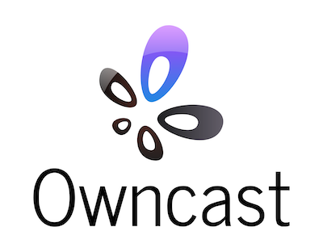

 

  

  

    Take control over your content and stream it yourself.
     
    <a href="https://github.com/gabek/owncast"><strong>Explore the docs »</strong></a>
     
     
    <a href="https://goth.land/">View Demo</a>
    ·
    <a href="https://github.com/gabek/owncast/issues">Report Bug</a>
  

<!-- TABLE OF CONTENTS -->
## Table of Contents

* [About the Project](#about-the-project)
* [Getting Started](#getting-started)
  * [Prerequisites](#prerequisites)
  * [Installation](#installation)
  * [Usage](#usage)
* [Usage with OBS](#usage-with-obs)
* [Video storage and distribution options](#video-storage-options)
* [Advanced usage](#advanced-usage)
* [Building from source](#building-from-source)
* [Roadmap](#roadmap)
* [License](#license)
* [Contact](#contact)

<!-- ABOUT THE PROJECT -->
## About The Project

<!--  -->

### This is a work in progress.  The web UI is being worked on and functionality is still being tested and iterated on.  Feel free to test and give feedback, but it's not ready for production.

In 2020 the world changed when everyone become stuck in their homes, looking for creative outlets to share their art, skills and themselves from inside their bedroom.

This created an explosion of live streaming on Facebook Live, YouTube Live, Instagram, and Twitch.  These services provided everything they needed, an easy way to live stream to the world, and a chat for users to be a part of their community.

But in a world where many were previously finding ways to rely on the big internet service companies less, the 2020 COVID-19 pandemic made everyone run right back to them.

And as soon as people started streaming their DJ sets, movie watching parties, and themselves just sitting around listening to music the big companies came to mute their streams, remove their recordings or ban these users all together.

That's when I wanted a better option for people. Something you could run yourself and get all the functionality of these services, where you could live stream to an audience and and allow them to take part in the chat, just like they've been used to on all the other services. But instead of handing control over to somebody else, you run it.  **You won't get shut down, and you own it all, just like it should be.**

I figured you can install Wordpress and self-host your blog, or install Megento and self-host your e-commerce site.  You can install Icecast and have your own internet radio station.  Spin up an instance of Mastodon and you have your own social media site that you control.  You can even install Nextcloud and have your own personal productivity service replacing Dropbox and Google Docs.  There's an open-source alternative to all the big services that you can run for almost everything, but I couldn't think of what the live video streaming equivalent was.  **There should be a independent, standalone _Twitch in a Box_.**

**Keep in mind that while streaming to the big social companies is always free, you pay for it with your identity and your data, as well as the identity and data of every person that tunes in.  When you self-host anything you'll have to pay with your money instead.  But running a self-hosted live stream server can be done for as cheap as $5/mo, and that's a much better deal than selling your soul to Facebook, Google or Amazon.**

---

<!-- GETTING STARTED -->
## Getting Started

The goal is to have a single service that you can run and it works out of the box, but there are some things you need to have, and some choices you might want to make.

### Prerequisites

* **A computer that's on the public internet to run it on.**  While crunching through video and serving it to viewers can be intensive from the computing side, you can get away with pretty meager resources.  If you don't already have a server to run it on you can get a [Linode](https://www.linode.com/products/nanodes/) instance for $5/mo that runs it fine.  If you worry that you'll be maxing out the bandwidth or transfer limits allotted to you, then utilize [Amazon S3](https://aws.amazon.com/s3/) very cheaply (or even free for a certain amount) to serve the files instead.

* [ffmpeg](https://ffmpeg.org/) is required to function.  [Install it](https://ffmpeg.org/download.html) first.
* These instructions are assuming you're using [OBS](https://obsproject.com/) on your personal computer to stream from.  It's not required, but it's a great free piece of software.

### Installation
 
1. **TODO: Once it's installable add directions here.**
1. Copy config/config-example.yaml to config/config.yaml.
1. Edit the config file and point it to `ffmpeg`
1. Set a custom streaming key by editing `streamingKey` in your config.

### Usage
1. Run `./owncloud` from the directory you unzipped it.
1. Open your web browser and visit http://yourserver:8080/.  If you changed the port in the config file, then change the URL accordingly.  If you are testing this on your own personal computer then you can visit http://localhost:8080.

## Usage with OBS

1. Install [OBS](https://obsproject.com/) and get it working with your local setup.
1. Open OBS Settings and go to "Stream".
2. Select "Custom..." as the service.
3. Enter the URL of the server running your streaming service in the format of rtmp://myserver.net/live.
4. Enter your "Stream Key" that matches the key you put in your `config.yaml` file.
5. Start the server.
6. Press "Start Streaming" on OBS.

## Video storage options

Three ways of storing and distributing the video are supported.

1. [Locally](#local-file-distribution) via the built-in web server.
2. [Amazon S3](#amazon-s3).
3. Experimental [IPFS](#ipfs) support.

### Local file distribution

This is the simplest and works out of the box.  In this scenario video will be served to the public from the computer that is running the server.  If you have a fast internet connection, enough bandwidth alotted to you, and a small audience this may be fine for many people.

### Amazon S3

Enable S3 support in `config.yaml` and add your AWS access credentials. Files will be distributed from a S3 bucket that you have created for this purpose.  This is a good option for almost any case since S3 is cheap and you don't have to worry about your own bandwdith.

### IPFS

From the [IPFS website](https://ipfs.io/):

> Peer-to-peer IPFS saves big on bandwidth — up to 60% for video — making it possible to efficiently distribute high volumes of data without duplication.

Enable experimental IPFS support and your video will be distributed through the [IPFS network](https://ipfs.io/#how).  In this scenario viewers will stream the video from IPFS nodes instead of the server running the service.  This is free but **can be very slow**.  It can also be just fine, you'll have to experiment for yourself.  It can sometimes take too long for the network to get the video to the user, resulting in delays and heavy buffering.  Try it if you like and make any suggestions on how to make it better so everyone can have free global video distribution without paying for a CDN or a 3rd party storage service.

By editing the config file you can change what IPFS gateway server is used, and you can experiment with [trying different ones](https://ipfs.github.io/public-gateway-checker/).

## Advanced Usage

Here's a list of some things you can do to increase performance and make things nicer for yourself.

* Put a CDN in front of your server if you serve your files locally.  You can even get a free one like [Cloudflare](https://www.cloudflare.com/).  Then as more people view your stream people will no longer be downloading the stream directly from your server, but from the CDN instead, and it'll be faster.  This is also a good way to enable SSL for your site.

* If you use Amazon S3 for storage, have it [expire files from your bucket after N days](https://docs.aws.amazon.com/AmazonS3/latest/user-guide/create-lifecycle.html) because old files sitting on your S3 bucket aren't useful to anybody.

* Edit the `webroot/index.html` file and make it look however you want.

* Add a `<video>` [tag](https://www.w3schools.com/tags/tag_video.asp) into your existing site and point it at your streaming server's `/hls/stream.m3u8` file and not use the built in web UI at all.

* [Run Nginx](https://docs.nginx.com/nginx/admin-guide/security-controls/securing-http-traffic-upstream/) as a proxy somewhere to support SSL or caching.

## Building from Source

1. Install the [Go toolchain](https://golang.org/dl/).
1. Clone the repo.  `git clone https://github.com/gabek/owncast`
1. Follow the above [Getting Started](#getting-started) instructions, making sure ffmpeg exists and your config file is set.
1. `go run *.go` on the first run will download the required packages needed for the application to build.
1. It will start running the same as in the above [Usage](#usage) instructions and you can point [OBS to your localhost](#usage-with-obs) instance of it.

## Roadmap

The following is a list of things, as long as there's some traction, I'd like to focus on.

* Real web layout and chat UI is being worked on by [gingervitis](https://github.com/gingervitis).

* Utilizing non-Amazon owned, but still S3 compatible storage.  There's so many services out there that are S3 compatible such as [Linode Object Storage](https://www.linode.com/products/object-storage/), [Wasabi](https://wasabi.com/what-is-wasabi/), [Backblaze](https://www.backblaze.com/b2/cloud-storage-pricing.html), [Google Storage](https://cloud.google.com/storage/), [DreamHost DreamObjects](https://www.dreamhost.com/cloud/storage/), or you can [even run your own](https://min.io/).  So it's good to have options.

* Refactor chat so it's more controlled by the server and doesn't accept just anything from clients and relay it back to everyone.

* Add more functionality to chat UI such as moderation (deleting messages), emojis/gif search, etc.  You know, the stuff other services have and people are used to.

* HLS adaptive bitrates.  Right now there's a single bitrate being generated.  We should be able to enable an array of bitrates in the config and spit out a HLS master playlist pointing to all of them.

* Collect viewer stats so you know how many people tuned into a stream.  People seem to care about that kind of thing.

* Add a simple setup wizard that will generate the config file for you on the first run by asking simple questions.

* A web Admin UI that allows you to edit settings and view stats, moderate chat, etc.

* Add built-in Let's Encrypt support so SSL is enabled out of the box.

* Add a Dockerfile so you can run it from a container.

<!-- LICENSE -->
## License

Distributed under the MIT License. See `LICENSE` for more information.

<!-- CONTACT -->
## Contact

Gabe Kangas - [@gabek@mastodon.social](https://mastodon.social/@gabek) - email [gabek@real-ity.com](mailto:gabek@real-ity.com)

Project Link: [https://github.com/gabek/owncast](https://github.com/gabek/owncast)
