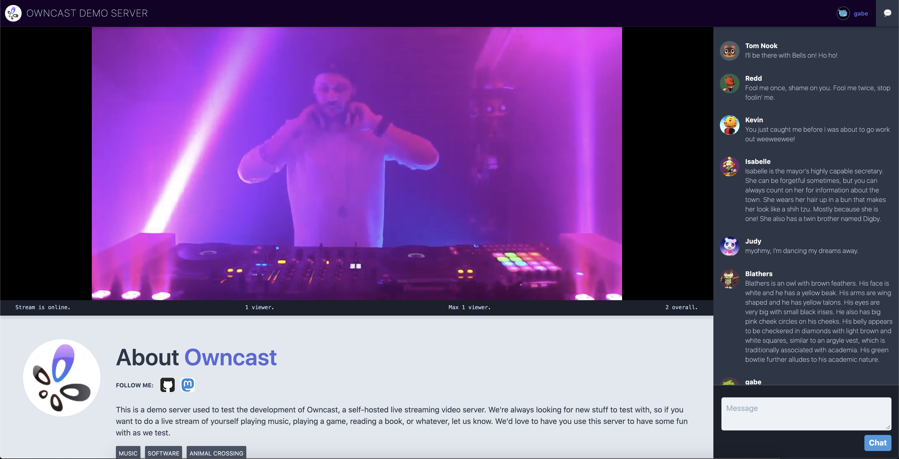

 

  

  

    Take control over your content and stream it yourself.
     
    <a href="https://github.com/gabek/owncast/tree/master/doc"><strong>Explore the docs »</strong></a>
     
     
    <a href="https://goth.land/">View Demo</a>
    ·
    <a href="https://github.com/gabek/owncast/tree/master/doc/faq.md">FAQ</a>
    .
    <a href="https://github.com/gabek/owncast/issues">Report Bug</a>
  

<!-- TABLE OF CONTENTS -->
## Table of Contents

* [About the Project](#about-the-project)
* [Getting Started](#getting-started)
  * [Prerequisites](#prerequisites)
  * [Getting Started](#getting-started)
  * [Configuration](#configuration)
* [Use with your software](#use-with-your-desktop-software)
  * [OBS & Streamlabs](#usage-with-obs)
  * [Restream](#usage-with-restream)
* [Video storage and distribution options](#video-storage-options)
* [Building from source](#building-from-source)
* [License](#license)
* [Contact](#contact)

<!-- ABOUT THE PROJECT -->
## About The Project

  

In 2020 the world changed when everyone become stuck in their homes, looking for creative outlets to share their art, skills and themselves from inside their bedroom.

This created an explosion of live streaming on Facebook Live, YouTube Live, Instagram, and Twitch.  These services provided everything they needed, an easy way to live stream to the world, and a chat for users to be a part of their community.

But in a world where many were previously finding ways to rely on the big internet service companies less, the 2020 COVID-19 pandemic made everyone run right back to them.

And as soon as people started streaming their DJ sets, movie watching parties, and themselves just sitting around listening to music the big companies came to mute their streams, remove their recordings or ban these users all together.

That's when I wanted a better option for people. Something you could run yourself and get all the functionality of these services, where you could live stream to an audience and and allow them to take part in the chat, just like they've been used to on all the other services. But instead of handing control over to somebody else, you run it.  **You won't get shut down, and you own it all, just like it should be.**

I figured you can install Wordpress and self-host your blog, or install Megento and self-host your e-commerce site.  You can install Icecast and have your own internet radio station.  Spin up an instance of Mastodon and you have your own social media site that you control.  You can even install Nextcloud and have your own personal productivity service replacing Dropbox and Google Docs.  There's an open-source alternative to all the big services that you can run for almost everything, but I couldn't think of what the live video streaming equivalent was.  **There should be a independent, standalone _Twitch in a Box_.**

**Keep in mind that while streaming to the big social companies is always free, you pay for it with your identity and your data, as well as the identity and data of every person that tunes in.  When you self-host anything you'll have to pay with your money instead.  But running a self-hosted live stream server can be done for as cheap as $5/mo, and that's a much better deal than selling your soul to Facebook, Google or Amazon.**

---

<!-- GETTING STARTED -->
### Prerequisites

* **A computer that's on the public internet to run it on.**  While crunching through video and serving it to viewers can be intensive from the computing side, you can get away with pretty meager resources on a simple setup.  If you don't already have a server to run it on you can get a [Linode](https://www.linode.com/products/nanodes/) instance for $5/mo that runs it fine.  If you worry that you'll be maxing out the bandwidth or transfer limits allotted to you, then utilize [S3 Storage](https://github.com/gabek/owncast/blob/master/doc/S3.md) very cheaply (or even free for a certain amount) to serve the files instead.

## Getting Started

The goal is to have a single service that you can run and it works out of the box. **Visit the [Quickstart](doc/quickstart.md) to get up and running.**

## Configuration

Many aspects can be adjusted and customized to your preferences.  [Read more about Configuration](/doc/configuration.md) to update the web UI and video easily.

## Use with your desktop software

### Usage with OBS

OBS isn't required, but it's a pretty good piece of free software that will get you streaming from your own computer right away.

1. Install [OBS](https://obsproject.com/) or [Streamlabs OBS](https://streamlabs.com/) and get it working with your local setup.
1. Open OBS Settings and go to "Stream".
2. Select "Custom..." as the service.
3. Enter the URL of the server running your streaming service in the format of rtmp://myserver.net/live.
4. Enter your "Stream Key" that matches the key you put in your `config.yaml` file.
5. Start the server.
6. Press "Start Streaming" (OBS) or "Go Live" (Streamlabs) on OBS.

### Usage with Restream

Read the [detailed documentation for working with Restream](https://github.com/gabek/owncast/blob/master/doc/restream.md)

## Video storage options

Three ways of storing and distributing the video are supported.

1. [Locally](#local-file-distribution) via the built-in web server.
2. [S3-compatible storage](#s3-compatible-storage).

### Local file distribution

This is the simplest and works out of the box.  In this scenario video will be served to the public from the computer that is running the server.  If you have a fast internet connection, enough bandwidth alotted to you, and a small audience this may be fine for many people.

### S3-Compatible Storage

Enable S3 support in `config.yaml` and add your access credentials. Files will be distributed from a S3 bucket that you have created for this purpose.  This is a good option for almost any case since S3 is cheap and you don't have to worry about your own bandwidth.

Please read the [more detailed documentation about configuration of S3-Compatible Services](https://github.com/gabek/owncast/blob/master/doc/S3.md).

## Building from Source

1. Ensure you have the gcc compiler configured.
1. Install the [Go toolchain](https://golang.org/dl/).
1. Clone the repo.  `git clone https://github.com/gabek/owncast`
1. Follow the above [Getting Started](#getting-started) instructions, making sure ffmpeg exists and your config file is set.
1. `go run main.go` on the first run will download the required packages needed for the application to build.
1. It will start running the same as in the above [Usage](#usage) instructions and you can point [OBS to your localhost](#usage-with-obs) instance of it.

<!-- LICENSE -->
## License

Distributed under the MIT License. See `LICENSE` for more information.

<!-- CONTACT -->
## Contact

Gabe Kangas - [@gabek@mastodon.social](https://mastodon.social/@gabek) - email [gabek@real-ity.com](mailto:gabek@real-ity.com)

Project Link: [https://github.com/gabek/owncast](https://github.com/gabek/owncast)
