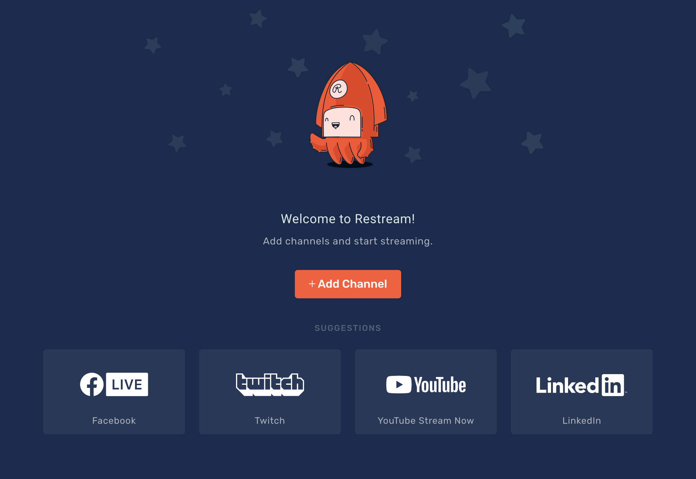
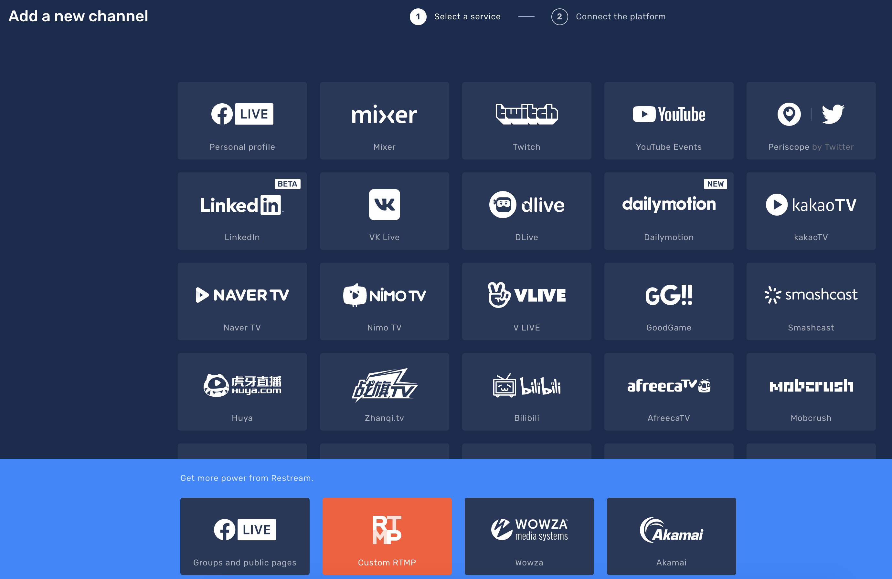
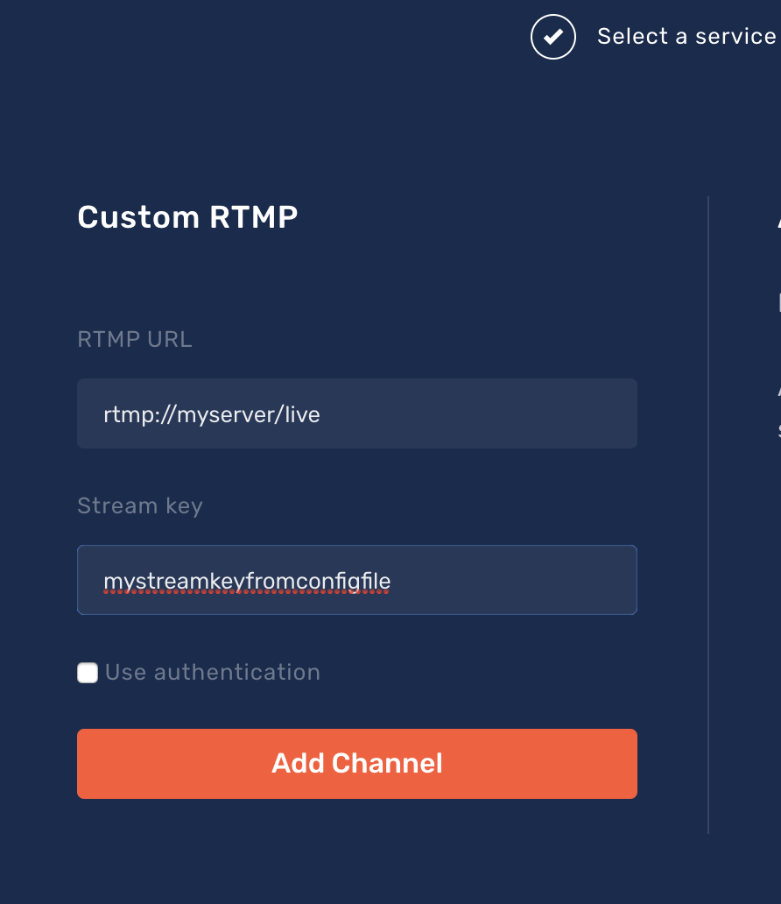

# Restream.io

If you're a paid user of [Restream](http://restream.io) you can point it at your Ownstream instance as another place to braodcast to.
1. Login and go to the "Add Channel" screen.

1. Select "Custom RTMP"

1. Add your server information in the format of `rtmp://myserver/live` for the RTMP URL and the Stream Key that matches what is in your `config.yaml` file.
