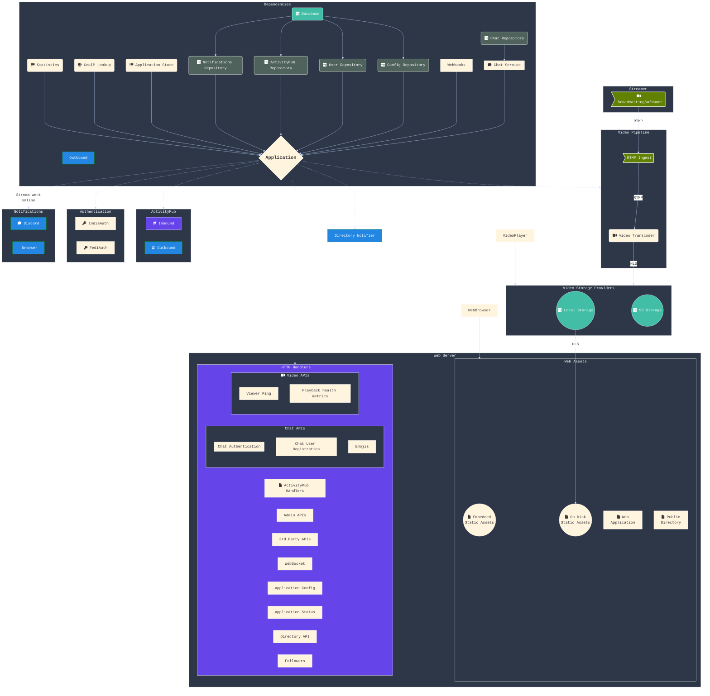

# Owncast Backend Architecture

This is a work in progress document detailing the future backend architecture of Owncast. It should be seen as a living document until a refactor of the backend is complete.

## Dependencies

Dependencies are services that are required across the application. This can be things like the chat service or a data repository for config values or user data.

Note: A better name that "dependencies" might be clearer. Perhaps "services" or "providers".

TODO: Have a complete list of dependencies.

### Data Repositories

The repository pattern provides a layer of abstraction between the application and the data store, allowing the application to interact with the data store through a well-defined interface, rather than directly accessing the data store. This helps to decouple the application from the data store.

TODO: List out the repositories and what they do.

Learn more about the [repository pattern](https://techinscribed.com/different-approaches-to-pass-database-connection-into-controllers-in-golang/).

### Application Controller

The `AppController` has references to all the dependencies and serves as an arbiter between consumers of these services and the services themselves.

A reference to the `AppController` is passed in to the all the core functionality in the application and each package would have its own interface that `AppController` implements. This can include getting access to dependency services like getting access to the chat service, getting access to the config repository values or knowing application state such as if a stream is live or how many viewers are watching via metrics.

TODO: Show examples of how the application is passed in to packages and how to reference dependencies through it.

## Diagram

