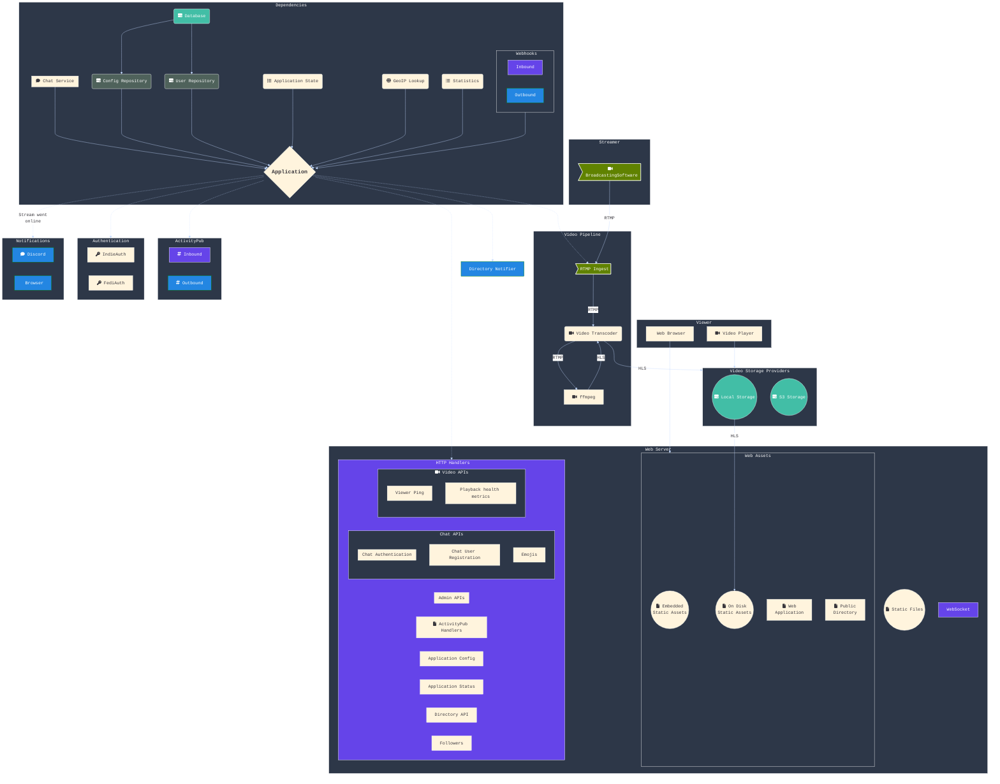

# Owncast Backend Architecture

Work in progress documentation detailing the backend architecture of Owncast.

## Structure

WIP

## Diagram

```mermaid
%% Owncast backend architecture.
%% See https://jojozhuang.github.io/tutorial/mermaid-cheat-sheet/
%% for a cheat sheet on creating this diagram.
%% Paste this document in https://mermaid.live as a quick way to edit.

%% This is a graph style diagram, Top Down.
graph TD


%% Define Nodes and Subgraphs

subgraph VideoPipeline[Video Pipeline]
    VideoTranscoder(fa:fa-video Video Transcoder)
    RTMPService[fa:fa-video RTMP Service]
    FFMpeg[fa:fa-video ffmpeg]
end

subgraph ChatService[fa:fa-comment Chat Service]
end

subgraph Dependencies
    subgraph Webhooks[fa:fa-webhook Webhooks]
        InboundWebhooks[Inbound]
        OutboundWebhooks[Outbound]
    end

    App{Application}
    ChatService--->App
    Webhooks--->App
    ConfigRepository(fa:fa-hard-drive Config Repository)--->App
    UserRepository(fa:fa-hard-drive User Repository)--->App
    Database(fa:fa-hard-drive Database)--->ConfigRepository
    Database--->UserRepository
    ApplicationState(fa:fa-list Application State)--->App
    GeoIP(fa:fa-globe GeoIP Lookup)--->App
    Statistics(fa:fa-list Statistics)--->App
end

subgraph VideoStorageProviders[Video Storage Providers]
    LocalStorage((fa:fa-hard-drive Local Storage))
    S3Storage((fa:fa-hard-drive S3 Storage))
end

subgraph ActivityPub
    ActivityPubInboundHandlers[fa:fa-hashtag Inbound]
    ActivityPubOutboundHandlers[fa:fa-hashtag Outbound]
end

subgraph Authentication
    IndieAuth[fa:fa-key IndieAuth]
    FediAuth[fa:fa-key FediAuth]
end

subgraph Notifications
    DiscordNotifier[fa:fa-comment Discord]
    BrowserNotifier[fa:fa-browser Browser]
end

subgraph WebServer[Web Server]
    ActivityPubHandlers[fa:fa-file ActivityPub Handlers]
    StaticFiles((fa:fa-file Static Files))
    WebSocket[WebSocket]

    subgraph WebAssets[Web Assets]
        EmbeddedStaticFiles((fa:fa-file Embedded\nStatic Assets))
        OnDiskStaticFiles((fa:fa-file On Disk\nStatic Assets))
        WebApplication[fa:fa-file  Web\nApplication]
        PublicFiles[fa:fa-file Public\nDirectory]
    end

    subgraph HTTPHandlers[fa:fa-browser HTTP Handlers]
        subgraph AdminAPIs[Admin APIs]
        end
        subgraph ChatAPIs[Chat APIs]
            ChatUserRegistration[Chat User Registration]
            Emoji[Emojis]
            subgraph ChatAuthAPIs[Chat Authentication]
                FediAuth
                IndieAuth
            end
        end
        subgraph VideoAPIs[fa:fa-video Video APIs]
            ViewerPing[Viewer Ping]
            PlaybackMetrics[Playback health metrics]
        end
        ActivityPubHandlers
        ApplicationConfig[Application Config]
        ApplicationStatus[Application Status]
        Directory[Directory API]
        Followers[Followers]
    end
end

subgraph Streamer
    BroadcastingSoftware>fa:fa-video BroadcastingSoftware]
end

subgraph Viewer
    VideoPlayer[fa:fa-video Video Player]
    WebBrowser[fa:fa-browser Web Browser]
end


%% All the services and packages require access
%% to dependencies through a Application reference.
App-.->HTTPHandlers
App-.->RTMPService
App-.->ActivityPub
App-.->Authentication
App-.Stream went\nonline.->Notifications
App-.->DirectoryNotifier[Directory Notifier]

LocalStorage--HLS-->OnDiskStaticFiles

RTMPService>RTMP Ingest]--RTMP-->VideoTranscoder
VideoTranscoder--HLS-->VideoStorageProviders
VideoTranscoder--RTMP-->FFMpeg
FFMpeg--HLS-->VideoTranscoder

%% Viewers
VideoPlayer-->VideoStorageProviders
WebBrowser-->WebAssets

%% Streamers
BroadcastingSoftware--RTMP-->RTMPService

%% Style the nodes

%% Define reusable styles for node types
classDef bigtext font-weight:bold,font-size:20px
classDef repository fill:#4F625B,color:#fff
classDef webservice fill:#6082B6,color:#fff
classDef rtmp fill:#608200, color:#fff
classDef inbound fill:#6544e9,stoke:#fff,color:#fff
classDef outboundservice fill:#2386e2,stroke:green,color:#fff
classDef storage fill:#42bea6,color:#fff

%% Assign styles to nodes
class App bigtext
class UserRepository repository
class ConfigRepository repository

class WebSocket inbound
class HTTPHandlers inbound
class ActivityPubInboundHandlers inbound
class InboundWebhooks inbound

class ActivityPubOutboundHandlers outboundservice
class DiscordNotifier outboundservice
class BrowserNotifier outboundservice
class OutboundWebhooks outboundservice
class DirectoryNotifier outboundservice

class BroadcastingSoftware rtmp
class RTMPService rtmp

class Database storage
class LocalStorage storage
class S3Storage storage

%% Customize the theme styles
%%{init: {'theme':'base', 'themeVariables': {'darkMode': true, 'lineColor': '#c3dafe', 'tertiaryTextColor': 'white', 'clusterBkg': '#2d3748', 'primaryTextColor': '#39373d', "edgeLabelBackground": "white", "fontFamily": "monospace"}}}%%
```
